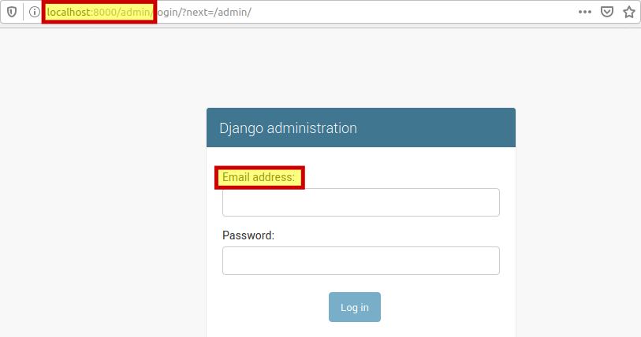

# django-2.1_auth_with_email

Esto es algo que siempre me olvido de como hacerlo, así que generé un proyecto vacío dónde solo cambié la forma de autenticarse utilizando el correo electrónico.


## Pantallazos




## Cambios al proyecto original

Al final de nuestro settings agregamos el siguiente código:

*config/settings.py*

```python
INSTALLED_APPS += [
    'apps.users',
]
AUTH_USER_MODEL = 'users.User'
```

En el models de nuestra app users

*apps/users/models.py*

```python
from django.db import models
from django.contrib.auth.models import AbstractUser
from django.utils.translation import gettext_lazy as _


class User(AbstractUser):
    email = models.EmailField(_('email address'), unique=True)
    USERNAME_FIELD = 'email'
    REQUIRED_FIELDS = ['username']
```

Y esto es todo, no necesitamos más, solo nos queda realizar una migración para crear la base de datos y listo.